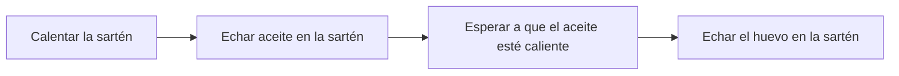
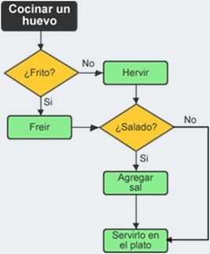
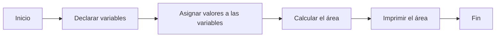

# Algoritmos, pseudocódigo y diagramas de flujo

## ¿Qué es un algoritmo?

Un algoritmo es una serie de pasos que se siguen para resolver un problema o realizar una tarea. Los algoritmos se pueden utilizar en cualquier ámbito, desde la cocina hasta la ingeniería.

Un algoritmo se caracteriza por ser:

* **Determinístico:** Los pasos del algoritmo siempre se siguen de la misma manera, independientemente de las condiciones iniciales.
* **Terminante:** El algoritmo debe terminar en algún momento, independientemente de las condiciones iniciales.
* **Eficiente:** El algoritmo debe utilizar los recursos de la manera más eficiente posible.

## ¿Qué es el pseudocódigo?

El pseudocódigo es una forma de describir un algoritmo de una manera que sea comprensible para los humanos. El pseudocódigo no es un lenguaje de programación real, sino que es un conjunto de convenciones que se utilizan para describir los algoritmos.

El pseudocódigo se suele utilizar para:

* **Escribir algoritmos de manera rápida y sencilla.**
* **Compartir algoritmos con otros programadores.**
* **Documentar algoritmos para su posterior revisión.**

## ¿Qué es un diagrama de flujo?

Un diagrama de flujo es una representación gráfica de un algoritmo. Los diagramas de flujo se utilizan para:

* **Visualizar el flujo de un algoritmo.**
* **Comprender el funcionamiento de un algoritmo.**
* **Comunicar un algoritmo a otros.**

## Ejemplos

**Algoritmo para cocinar un huevo frito:**
1. Calentar la sartén.
2. Echar aceite en la sartén.
3. Esperar a que el aceite esté caliente.
4. Echar el huevo en la sartén.

**Algoritmo para calcular el área de un círculo: en pseudocodigo**
```
// Inicio del algoritmo

// Declarar variables

real radio, area

// Asignar valores a las variables

radio = 5

// Calcular el área

area = 3.14 * radio * radio

// Imprimir el área

print("El área del círculo es ", area)

// Fin del algoritmo
```

**Diagrama de flujo para cocinar un huevo frito:**





**Diagrama de flujo para calcular el área de un círculo:**


## Diferencias entre algoritmo, pseudocódigo y diagrama de flujo
El pseudocódigo y los diagramas de flujo son dos herramientas complementarias que se utilizan para representar algoritmos. El pseudocódigo es una forma de describir un algoritmo de una manera que sea comprensible para los humanos. Los diagramas de flujo son una representación gráfica de un algoritmo.

## Ejercicios
